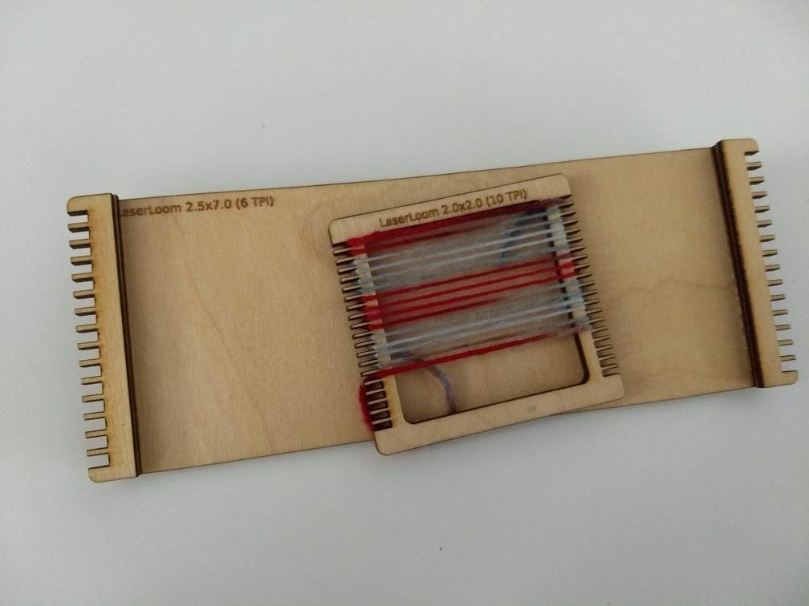

### Laser Cut Hand Loom generator

This is a small Python3 package to generate SVG files to laser cut a hand loom of a given style, tooth pitch and size.

Example:


You can run it as a Docker container by first building the local image by running `make build`. (you should only need to do this one time) 

Then you can test it by running `make run script=test_files.py`. 

Alternately you run it locally after installing the dependencies via `pip install -r requirements.txt` and then running `python3 test_files.py`

Either of these methods should generate 3 SVG files that you can view.  Also included it a `tpi_test.py` script that generates a small loom for each TPI setting.  You can have these cut and it can help you decide on the right setting for future weaving projects.

You can also make your own python script to generate a specific configuration.  

```
from laserloom import Loom

l = Loom()
l.loom_type = 'OPEN'
l.side_margin= 1/4.0
l.tooth_margin = 0.15
l.tpi = 10
l.working_size_length = 2.0
l.working_size_width = 2.0
l.generate()
print(l)
l.save('open_loom.svg')
```

Start by importing `Loom` class and instantiating a `Loom` object.

- `loom_type` is either `OPEN` or `PLATE` depending on the style you want to generate.  `OPEN` looms are better for smaller and roughly square pieces that are not warped very tightly.  `PLATE` looms are better or larger pieces that are more rectangular (either wide or long) that can be warped more tightly.  Since `PLATE` looms don't have an open hold in the middle to facilitate weaving the weft, the teeth are designed to be glued on top of plate to give enough space for weaving.

- `side_margin` is how much is available for gripping on either side of the working area.  This should be larger for `OPEN` looms to help with rigidity.

- `tooth_margin` is how 'deep` the teeth are cut.  Unless you are weaving with very thick yarn, the default is probably fine.

- `tpi` is the number of teeth/inch for your piece.  Right now the program can handle 4, 6, 8, 10 TPI.

- `working_size_length` this defines the maximum size in inches of your final work piece.  The final size of your loom will be larger.

- `working_size_width` this defines the maximum size in inches of your final work piece.  The final size of your loom will be larger.

After setting these values, you need to invoke the `generate` method of your loom object.  `print`ing it is optional but then you should write the SVG file by invoking `save(<filename>)`
